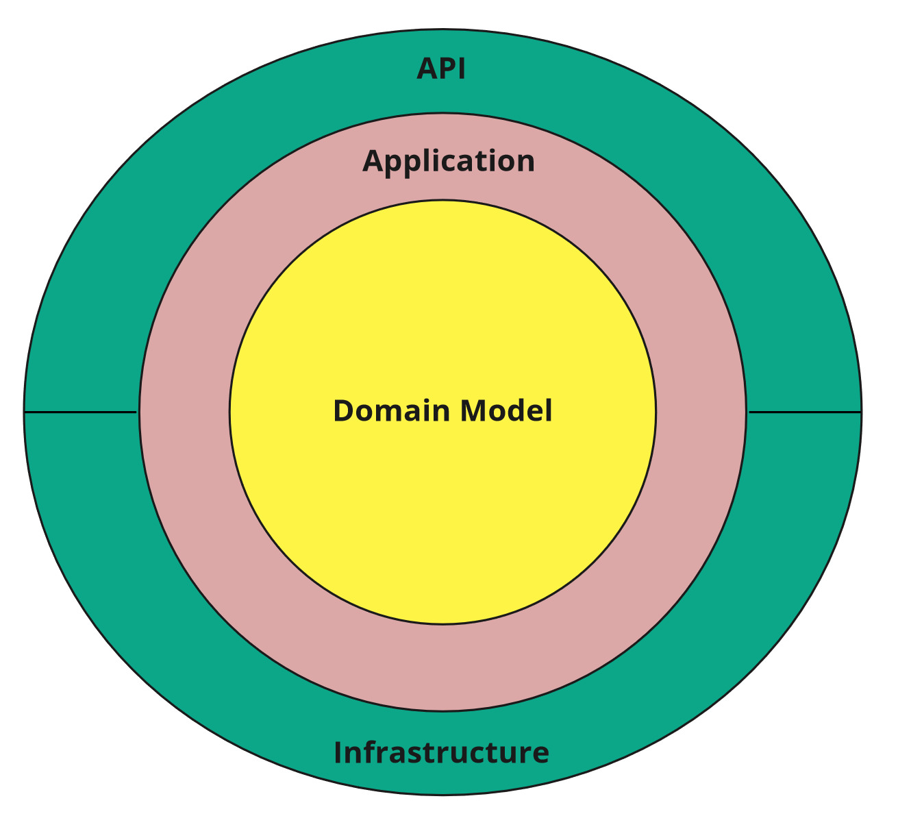

Sample .NET Core REST API CQRS implementation with raw SQL and DDD using Clean Architecture.
==============================================================

## (Sample for ADESSO)

## Description
Kullanıcıların A şehirinden B şehirine şahsi arabaları ile seyehat ederken yolcu bulabileceği API'nin aşağıda yazılı senaryolarının end pointlerini yazar mısınız?

1. Kullanıcı sisteme seyahat planını Nereden, Nereye, Tarih ve Açıklama, Koltuk Sayısı bilgileri ile ekleyebilmeli

2. Kullanıcı tanımladığı seyahat planını yayına alabilmeli ve yayından kaldırabilmeli
3. Kullanıcılar sistemdeki yayında olan seyahat planlarını Nereden ve Nereye bilgileri ile aratabilmeli
4. Kullanıcılar yayında olan seyehat planlarına "Koltuk Sayısı" dolana kadar katılım isteği gönderebilmeli

## Wiki (How to use)
If you want learn to more information for this app. and you can see wiki page of this app.
https://github.com/bierquelle06/CleanArchitectureADS/wiki/How-To-Use

## Architecture [Clean Architecture](http://blog.cleancoder.com/uncle-bob/2012/08/13/the-clean-architecture.html)

## CQRS

Read Model - executing raw SQL scripts on database views objects (using [Dapper](https://github.com/StackExchange/Dapper)).

Write Model - Domain Driven Design approach (using Entity Framework Core).

Commands/Queries/Domain Events handling using [MediatR](https://github.com/jbogard/MediatR) library.

## Validation

Data validation using [FluentValidation](https://github.com/JeremySkinner/FluentValidation)

Problem Details for HTTP APIs standard implementation using [ProblemDetails](https://github.com/khellang/Middleware/tree/master/src/ProblemDetails)

## Caching

Using Cache-Aside pattern and in-memory cache.

## Integration

Outbox Pattern implementation using [Quartz.NET](https://github.com/quartznet/quartznet)

## How to run application

1. Create empty database.
2. Execute InitializeDatabase.sql script.
2. Set connection string (in appsettings.json or by user secrets mechanism).
3. Run!

## How to run Integration Tests

1. Create empty database.
2. Execute InitializeDatabase.sql script.
3. Set connection string using environment variable named `ASPNETCORE_SampleProject_IntegrationTests_ConnectionString`
